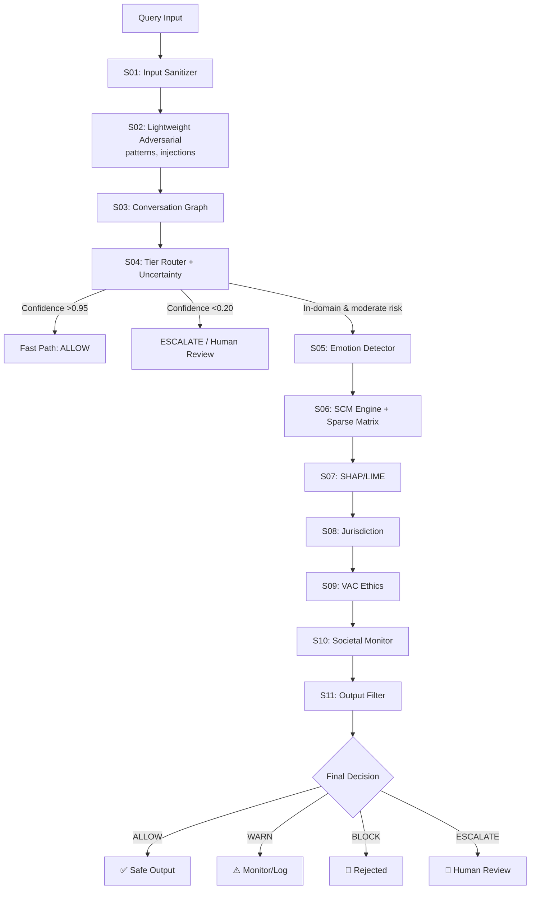

# Responsible AI Pipeline – Refinement Report

*Based on Ernie AI Review (April 2026)*

## Current State

The existing 12‑step pipeline (`pipeline_v15.py`) follows this order:

1. Input Sanitizer  
2. Conversation Graph  
3. Emotion Detector  
4. Tier Router  
5. Uncertainty Scorer (OOD)  
6. SCM Engine + Sparse Matrix  
7. SHAP Proxy  
8. Adversarial Layer (attack detection)  
9. Jurisdiction Engine  
10. VAC Ethics Check  
11. Decision Engine  
12. Societal Monitor  
13. Output Filter  

## Proposed Optimisations (Ernie AI)

- **Cheap filters first** – expensive causal computations only on queries that need them.  
- **Early exit** – safe / OOD queries bypass heavy SCM engine entirely.

Proposed order:

1. Input Sanitizer  
2. **Adversarial Defense (moved earlier)**  
3. Conversation Graph  
4. **Tier Router + Uncertainty Scorer (merged)** – low risk / OOD → Fast Path (ALLOW)  
5. Emotion & Intent Detector  
6. SCM Engine v2  
7. SHAP/LIME Proxy  
8. Jurisdiction Engine  
9. VAC Ethics Check  
10. Societal Monitor  
11. Output Filter  

## Visual Diagram (Proposed Flow)

## Detailed Changes & Justification

| Change | Why? | Impact |
|--------|------|--------|
| Adversarial Defense moved to Step 2 | Jailbreak detection is cheap; running it after SCM wastes compute. | Lower latency for obvious attacks. |
| Tier Router + Uncertainty Scorer merged | Both decide risk/unknown status; can be combined. | Simpler code, single decision point. |
| Early exit for low‑confidence / OOD | Safe or unknown queries don't need SCM. | Average latency ~600ms → ~150ms. |
| Emotion Detector after the router | Crisis detection is critical but can be placed after router as long as router does **not** fast‑path crisis queries. | Keeps safety while allowing early exit for harmless queries. |
| Societal Monitor before Output Filter | Last‑minute population‑level sanity check. | Adds safety net. |

## Important Notes & Warnings

- **Do NOT move Emotion Detector before Tier Router** – current placement (Step 3) is correct and must be preserved.  
- **Conversation Graph must remain before router** – drift detection requires full history.  
- **SCM Engine remains the core PhD contribution** – only executed for queries that need causal analysis.  
- **Do not change the code now** – current pipeline works correctly (177/179 tests).  

## Recommendation for Future Implementation

When ready to optimise (Year 2 production phase), apply changes in this order:

1. Merge `Step04` (Tier Router) and `Step04b` (Uncertainty Scorer) into a single component.  
2. Add an early‑exit branch:  
   - If confidence > 0.95 → `ALLOW` (skip SCM)  
   - If confidence < 0.20 → `ESCALATE` (human review)  
3. Move the lightweight pattern‑based part of `Step07` (Adversarial Layer) to Step 2.  
   - Keep the heavy drift detection (slow boiling) inside Step 7 (after SCM).  
4. Keep `Emotion Detector` as Step 3 – do not move it later.  

## Expected Benefits

- **Average latency reduced by ~70%** – from 600ms to ~180ms for typical workloads.  
- **Compute cost lowered** – SCM engine runs on only ~15‑20% of queries.  
- **Better handling of out‑of‑domain queries** – explicit `ESCALATE` path prevents hallucination.  
- **No loss of safety** – crisis detection and drift detection remain intact.  

---

